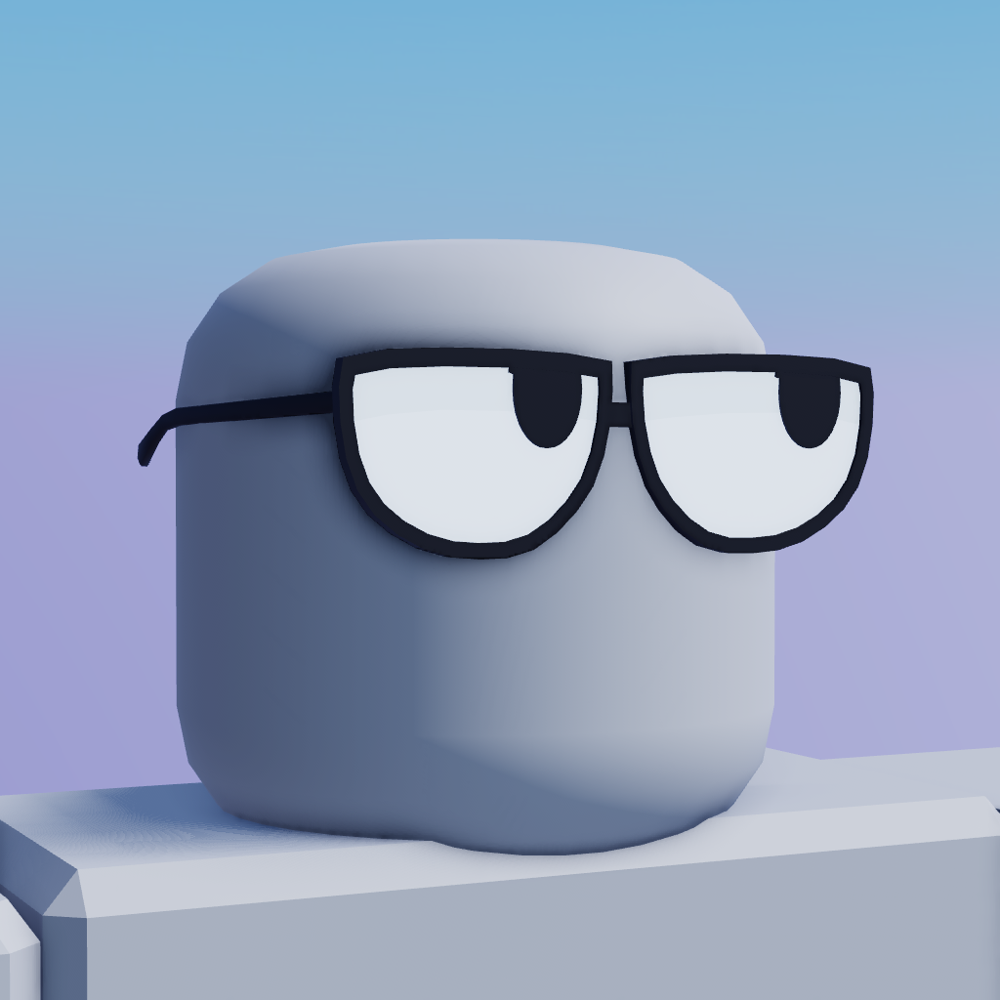
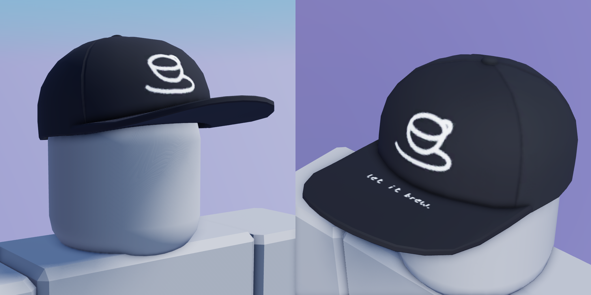
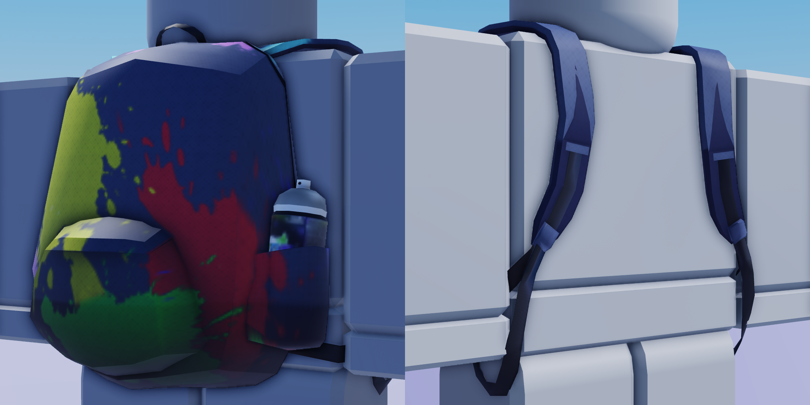
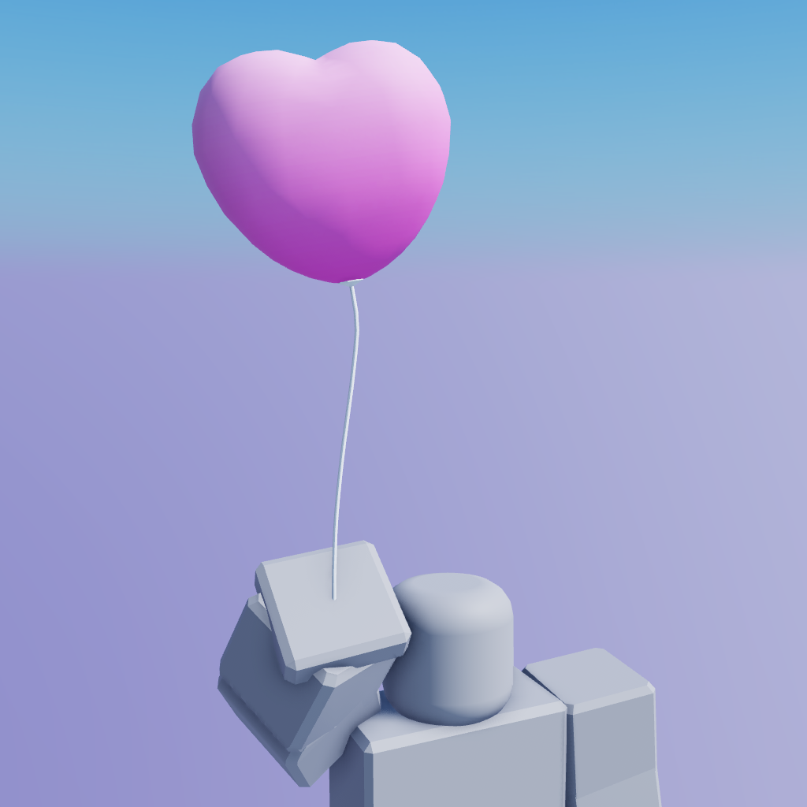
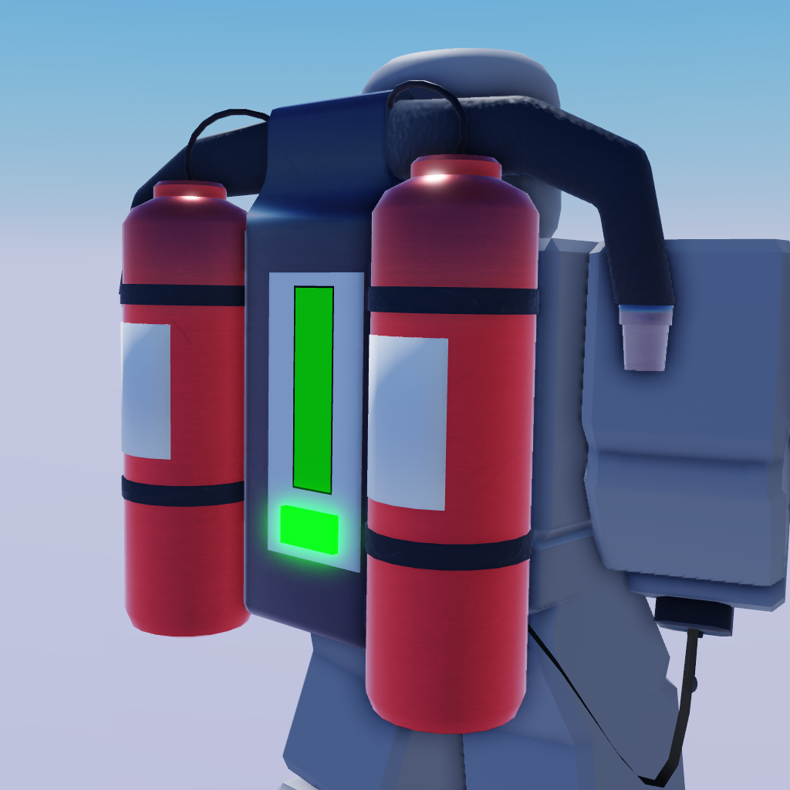
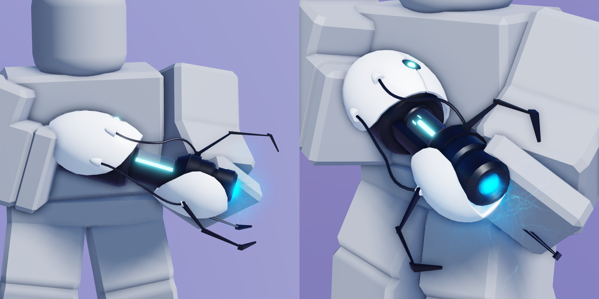
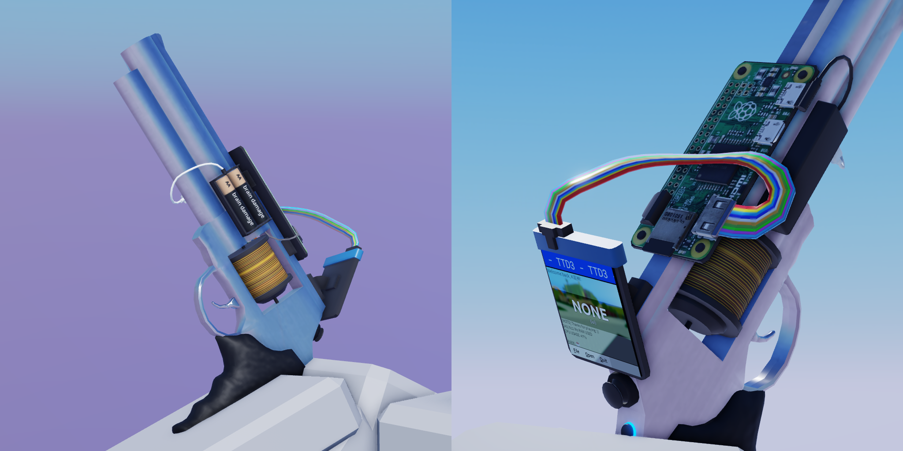
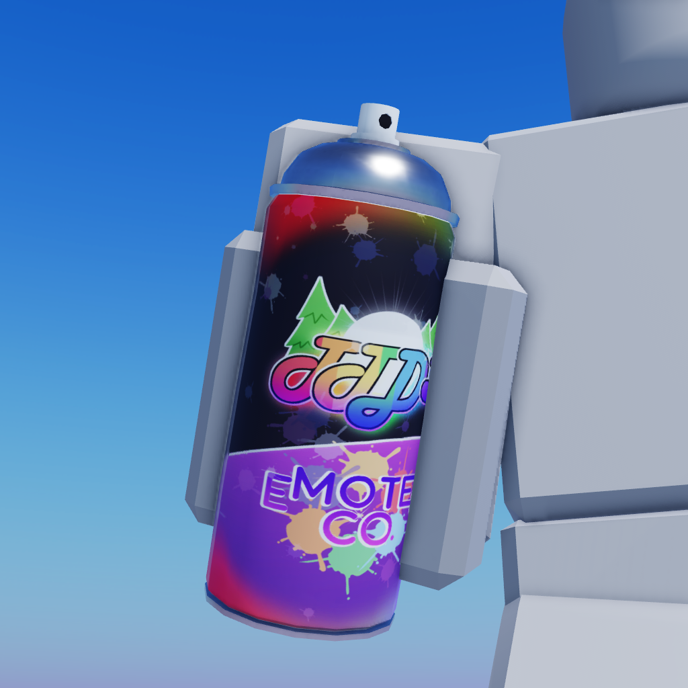

# 3D Modelling portfolio

Welcome to my 3D modelling portfolio! 
If you've been led here through a link, [you can learn more about me with my README.md](README.md)!

I've been learning 3D modelling on my own since February 2022. 
The main reasons why I started was through curiousity, and generally wanting to add more Tools to my game, [TTD 3](//ttd3.qts.life), therefor most of my creations are made for and polished with Roblox!

## Software

+ [Blender 3.2.1](//blender.org)
+ [paint.net](//getpaint.net)

## Creations

### Accessories

  
Bored Eyes "Glassis"

   
  Inspired by [@huiyunwenhua's Wacky Sunglasses](//www.roblox.com/catalog/6742512536/Wacky-Sunglasses)

  
cofi Branded Cap

   
  i so want this to become a UGC lol

  
Street Artist's Backpack

   
  I made this for my UGC application! [See the process here!](res/progress.pdf)

### Other

  
Heart shaped balloon

   
  This was basically one of my first 3D models..

  
Jetpack

   
  inspired by GTA:SA!

  
Portal gun

    
  I'm making a note here: `HUGE SUCCESS!`

  
Portal gun

     
  Toodoo, toodoo, banana bus!

  
Spray paint

     
  Texture made by [0HappY_L0@twitter](//twitter.com/0HappY_L0), the backpack was inspired by this!

