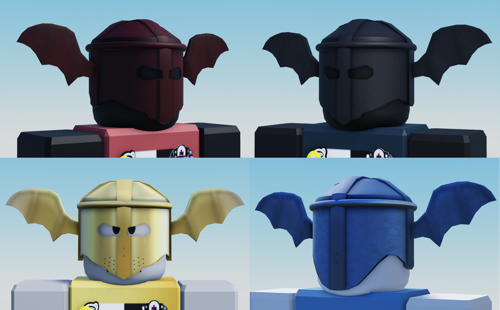

# 3D Modelling portfolio

Welcome to my 3D modelling portfolio! 
If you've been led here through a link, [you can learn more about me with my README.md](README.md)!

I've been learning 3D modelling on my own since February 2022. 
The main reasons why I started was through curiousity, and generally wanting to add more Tools to my game, [TTD 3](https://ttd3.qts.life), therefor most of my creations are made for and polished with Roblox!

## Software

+ [Blender 3.2.1](https://blender.org)
+ [paint.net](https://getpaint.net)

## Creations

### Accessories

  
Bored Eyes "Glassis"

  
   
  Inspired by [@huiyunwenhua's Wacky Sunglasses](https://www.roblox.com/catalog/6742512536/Wacky-Sunglasses)
  > [buy it here!](https://www.roblox.com/catalog/12134450393/Bored-Glassis)

  
cofi Branded Cap

  
   
  > [buy it here!](https://www.roblox.com/catalog/12134205990/cofi-Cap)

  
Street Artist's Backpack

  
   
  I made this for my UGC application! [See the process here!](res/progress.pdf)
  > [buy it here!](https://www.roblox.com/catalog/11919851882/Street-Artists-Backpack)

  
Bat Helmet

  
   
  This was a commission for a friend of mine
  > [buy them here!](https://www.roblox.com/catalog?Category=11&Subcategory=19&CreatorName=Studios%20Military%20Roleplay%20Fan%20Roblox%20Clothing&CreatorType=Group&salesTypeFilter=1)

### Other

  
Heart shaped balloon

  
   
  This was basically one of my first 3D models..

  
Jetpack

  
   
  inspired by GTA:SA!

  
Portal gun

  
    
  I'm making a note here: `HUGE SUCCESS!`

  
Tool gun

  
     
  Toodoo, toodoo, banana bus!

  
Spray paint

  
     
  Texture made by [0HappY_L0@twitter](//twitter.com/0HappY_L0), the backpack was inspired by this!

